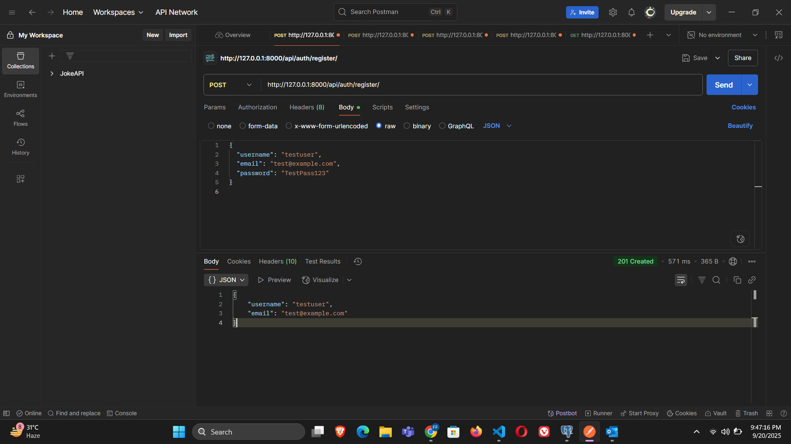
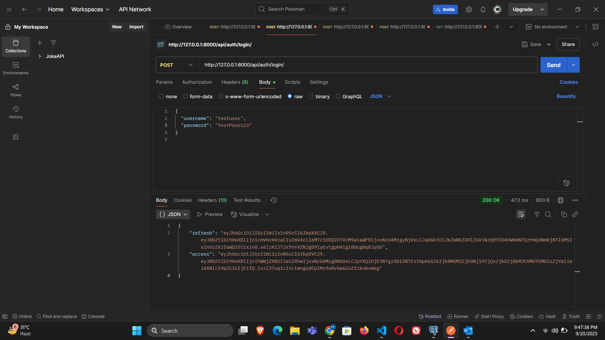
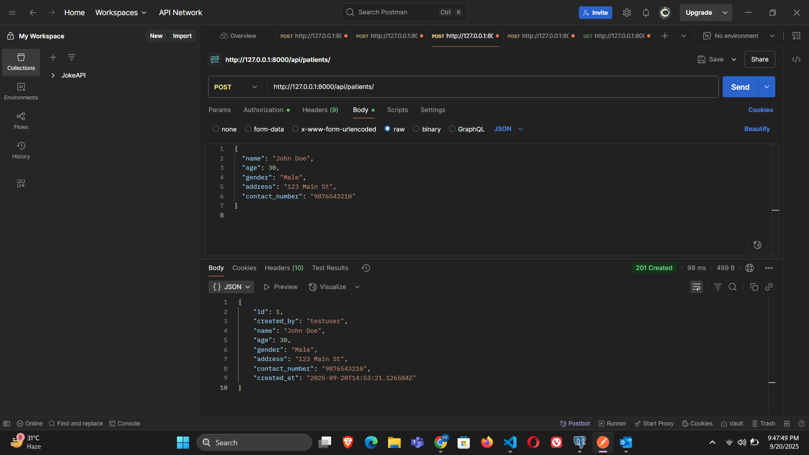
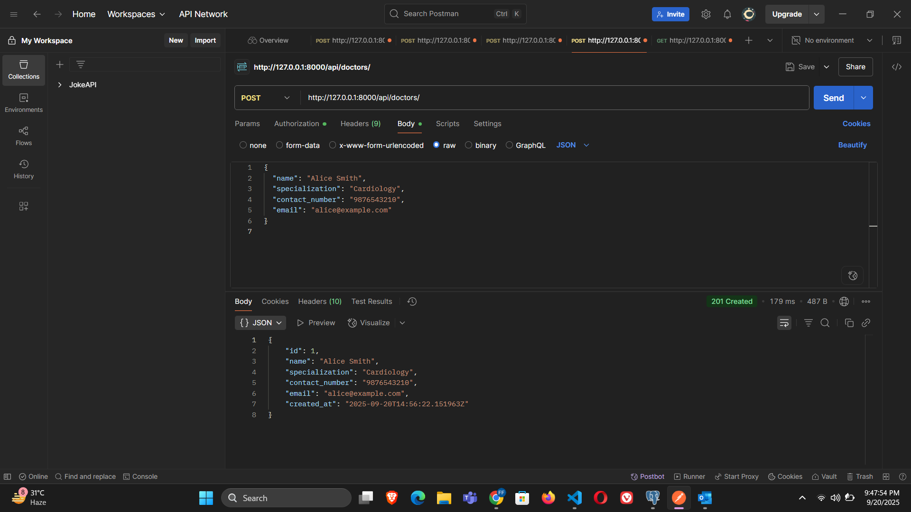
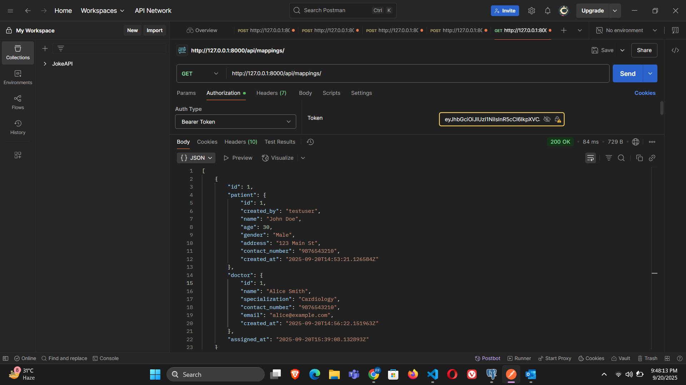

# Healthcare Backend Assignment

## Project Overview
This is a backend system for a healthcare application built using **Django**, **Django REST Framework (DRF)**, and **PostgreSQL**.  
The system allows users to register, log in, manage **patients** and **doctors**, and assign doctors to patients securely.

---

## Tech Stack

- **Backend Framework:** Django 4.2, Django REST Framework (DRF)  
- **Database:** PostgreSQL  
- **Authentication:** JWT (using `djangorestframework-simplejwt`)  
- **Environment Management:** `python-dotenv` for sensitive configs  
- **API Testing & Documentation:** Postman  
- **CORS Handling:** `django-cors-headers`  
- **Programming Language:** Python 3.10+  
- **Version Control:** Git & GitHub 

---

## Setup Instructions

1. **Clone the repository**
```bash
git clone https://github.com/Arshul26/Healthcare_Backend_Assignment.git
cd Healthcare_Backend_Assignment
```
---
2. **Create and activate a virtual environment**
```bash
python -m venv venv
venv\Scripts\activate  # Windows
```

3. **Install dependencies**
```bash
pip install -r requirements.txt
```
4. **Configure environment variables**
```bash
#Create a .env file in the root directory:
DJANGO_SECRET_KEY=your-secret-key
DB_NAME=your_db_name
DB_USER=your_db_user
DB_PASSWORD=your_db_password
DB_HOST=localhost
DB_PORT=5432
```
5. **Run migrations**
```bash
python manage.py migrate
```
6. **Run the development server**
```bash
python manage.py runserver
```

---

## API Endpoints:

### 1. Authentication
| Endpoint              | Method | Description              | Auth   |
| --------------------- | ------ | ------------------------ | ------ |
| `/api/auth/register/` | POST   | Register new user        | Public |
| `/api/auth/login/`    | POST   | Login and get JWT tokens | Public |


**Request Example:**
```json
{
  "username": "testuser",
  "email": "test@example.com",
  "password": "password123"
}
```
### 2. Patient Management

| Endpoint              | Method | Description                       | Auth |
| --------------------- | ------ | --------------------------------- | ---- |
| `/api/patients/`      | POST   | Add new patient                   | JWT  |
| `/api/patients/`      | GET    | List all patients created by user | JWT  |
| `/api/patients/<id>/` | GET    | Retrieve patient details          | JWT  |
| `/api/patients/<id>/` | PUT    | Update patient details            | JWT  |
| `/api/patients/<id>/` | DELETE | Delete patient                    | JWT  |

### 3. Doctor Management

| Endpoint             | Method | Description             | Auth |
| -------------------- | ------ | ----------------------- | ---- |
| `/api/doctors/`      | POST   | Add new doctor          | JWT  |
| `/api/doctors/`      | GET    | List all doctors        | JWT  |
| `/api/doctors/<id>/` | GET    | Retrieve doctor details | JWT  |
| `/api/doctors/<id>/` | PUT    | Update doctor details   | JWT  |
| `/api/doctors/<id>/` | DELETE | Delete doctor           | JWT  |

### 4. Patient-Doctor Mapping

| Endpoint                      | Method | Description                       | Auth |
| ----------------------------- | ------ | --------------------------------- | ---- |
| `/api/mappings/`              | POST   | Assign doctor to patient          | JWT  |
| `/api/mappings/`              | GET    | List all mappings                 | JWT  |
| `/api/mappings/<patient_id>/` | GET    | Get doctors assigned to a patient | JWT  |
| `/api/mappings/<id>/`         | DELETE | Remove a doctor from a patient    | JWT  |

## Documentation

- Postman Collection: `docs/postman_collection.json`
- API Response Screenshots:
  - Register API: 
  - Login API: 
  - Patient API: 
  - Doctor API: 
  - Mapping API: 
---